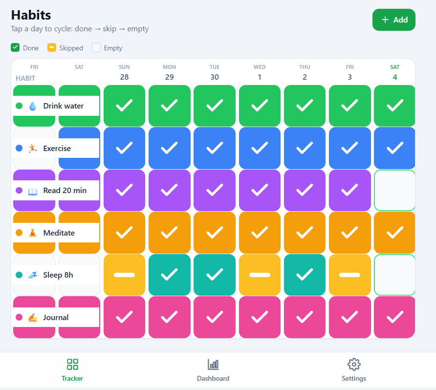
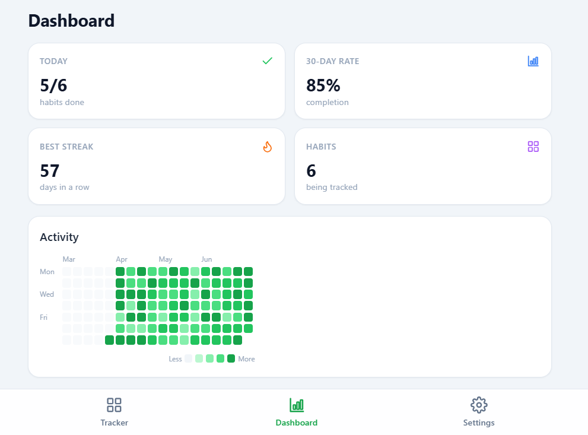
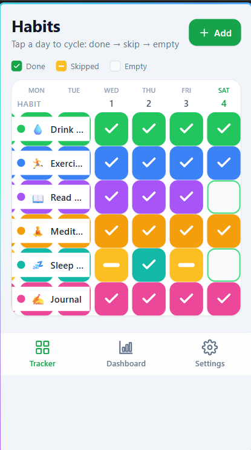
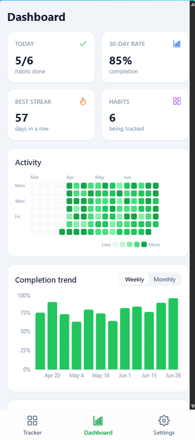
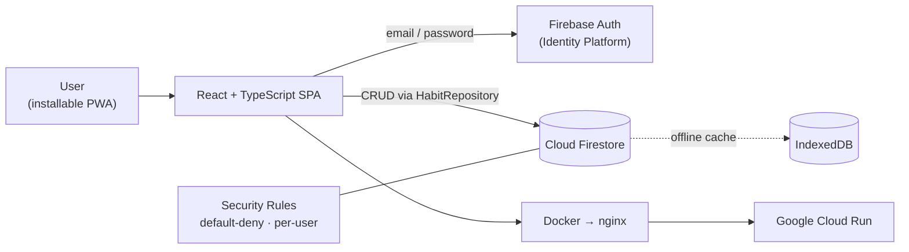

<div align="center">

# 🎯 Habit Tracker

### A fast, mobile-first habit tracker with real accounts, cloud sync, and rich analytics — installable as an offline PWA.

Build streaks, track your day with a single tap, and watch your progress come to
life on an analytics dashboard. A full-stack Progressive Web App backed by
Firebase Auth and Cloud Firestore, containerized with Docker, and deployed to
Google Cloud Run.

[](https://react.dev)
[](https://www.typescriptlang.org)
[](https://vitejs.dev)
[](https://tailwindcss.com)
[](https://firebase.google.com)
[](https://cloud.google.com/run)
[](https://web.dev/progressive-web-apps/)

</div>

---

## 🖼️ Screenshots

<table>
  <tr>
    <td width="50%" valign="top"><strong>Tracker</strong> — one-tap daily grid<br/><br/></td>
    <td width="50%" valign="top"><strong>Dashboard</strong> — streaks &amp; analytics<br/><br/></td>
  </tr>
</table>

<div align="center">
  <em>Mobile-first &mdash; installs to your home screen and works offline</em>
  <br/><br/>
  
  &nbsp;&nbsp;
  
</div>

---

## ✨ Highlights

- **One-tap tracking.** Tap a day to cycle it: **done → skip → empty**. Big,
  thumb-friendly targets designed for phones.
- **Streaks that understand real life.** A single "skip" (an intentional day
  off) keeps your streak alive; missing entirely resets it. Today stays
  "pending" so an unfinished day never breaks your run prematurely.
- **Insightful dashboard.** Current & longest streaks, completion rates
  (7 / 30 / all-time), a GitHub-style calendar heatmap, weekly/monthly trend
  charts, and a best-vs-worst habit ranking.
- **Real accounts & cloud sync.** Email/password auth with an admin-approval
  gate; your habits sync across every device through Cloud Firestore.
- **Offline-first & installable.** A full PWA — add it to your home screen and
  keep tracking with no connection. Changes reconcile automatically when you're
  back online.
- **Backfill history.** Forgot to log yesterday? Scroll back and edit any past
  day.
- **Own your data.** One-tap JSON export/import for backups.

## 🧠 How it works

Habits are rows; days are columns. Each tap advances a day through three states:

| State     | Meaning             | Effect on streak                  |
| --------- | ------------------- | --------------------------------- |
| ✅ Done   | You did it          | Extends the streak                |
| ➖ Skip   | Intentional day off | Bridges the streak (max 1 in row) |
| ⬜ Empty  | Not done            | Two skips or a miss resets it     |

The streak and analytics engine is written as **pure, unit-tested functions**,
keeping the business logic reliable and fully independent of the UI.

## 🏗️ Tech & architecture

| Layer          | Choice                                                             |
| -------------- | ----------------------------------------------------------------- |
| UI             | React 18 + TypeScript, built with Vite 5                          |
| Styling        | Tailwind CSS 3 (mobile-first; 4-day view on phones, 7 on laptops) |
| Auth           | Firebase Authentication (Google Cloud Identity Platform)          |
| Database       | Cloud Firestore with an offline persistent cache                  |
| Authorization  | Firestore Security Rules (default-deny, per-user isolation)       |
| Charts         | Recharts (lazy-loaded to keep the initial mobile bundle small)    |
| PWA            | vite-plugin-pwa (Workbox service worker + installable manifest)   |
| Tests          | Vitest + Testing Library                                          |
| Container      | Multi-stage Docker → nginx                                        |
| Hosting        | Google Cloud Run (serverless, scale-to-zero)                      |
| CI/CD          | GitHub Actions                                                    |

**Key design decisions**

- **Repository abstraction.** All data access goes through a single
  `HabitRepository` interface, implemented by `FirestoreHabitRepository`. The UI
  and hooks depend on the interface, so the storage backend is a swappable seam
  rather than something wired through every component.
- **Offline-first.** Firestore's persistent local cache serves reads and writes
  instantly and syncs in the background, so the app stays fully usable with no
  connection.
- **Security in the rules, not the client.** Access is enforced server-side by
  Firestore Security Rules: default-deny, users can only touch their own data,
  and habit/entry access additionally requires an approved profile.
- **Tested core logic.** The streak and analytics functions are pure and
  covered by unit tests, decoupled from React entirely.



## 🚀 Run it locally

Prerequisites: **Node.js 18+**.

```bash
npm install
npm run dev      # http://localhost:5173
```

Other scripts:

```bash
npm test         # run the unit tests (Vitest)
npm run build    # type-check + production build
npm run preview  # preview the production build
```

> **Backend config.** The app talks to Firebase Auth + Firestore. To point it at
> your own project, update the config in
> [`src/firebase/config.ts`](src/firebase/config.ts), set the admin email, and
> deploy [`firestore.rules`](firestore.rules). (Firebase web config values are
> public by design — security is enforced by the rules, not by hiding the keys.)

## 🧪 Testing

The business logic — streak calculation and dashboard analytics — is implemented
as pure functions with focused unit tests:

```bash
npm test
```

## 📦 Deployment

The app is a set of static files served by nginx inside a small multi-stage
Docker image, designed for **Google Cloud Run** (serverless, scale-to-zero).

- [`Dockerfile`](Dockerfile) builds the Vite bundle, then serves it from nginx.
- [`nginx/default.conf.template`](nginx/default.conf.template) reads Cloud Run's
  `$PORT` at startup and serves the SPA with an `index.html` fallback.
- This repository's **CI** (GitHub Actions) type-checks, runs the test suite,
  and produces a production build on every push and pull request.

```bash
# Build and run the container locally
docker build -t habit-tracker .
docker run --rm -p 8080:8080 -e PORT=8080 habit-tracker   # http://localhost:8080
```

## 🗺️ Roadmap

- 🔔 Reminder notifications.
- 🏷️ Habit categories & tags.
- 👥 Shared / household habits.
- 📊 CSV export for spreadsheets.

## 📬 Get in touch

Built by **Solomon Leo** as a personal project.
Happy to walk through the architecture, the tested streak engine, or the
local-first → cloud-sync design.

- 🐙 GitHub: [@solomonleo12345](https://github.com/solomonleo12345)
- 💼 LinkedIn: _add your LinkedIn URL_
- 📧 Email: _add your preferred contact email_

## 📄 License

Released under the **MIT License** — see [`LICENSE`](LICENSE).

---

<div align="center">
<sub>React · TypeScript · Tailwind · Firebase · Docker · Cloud Run — an offline-first, installable PWA</sub>
</div>
